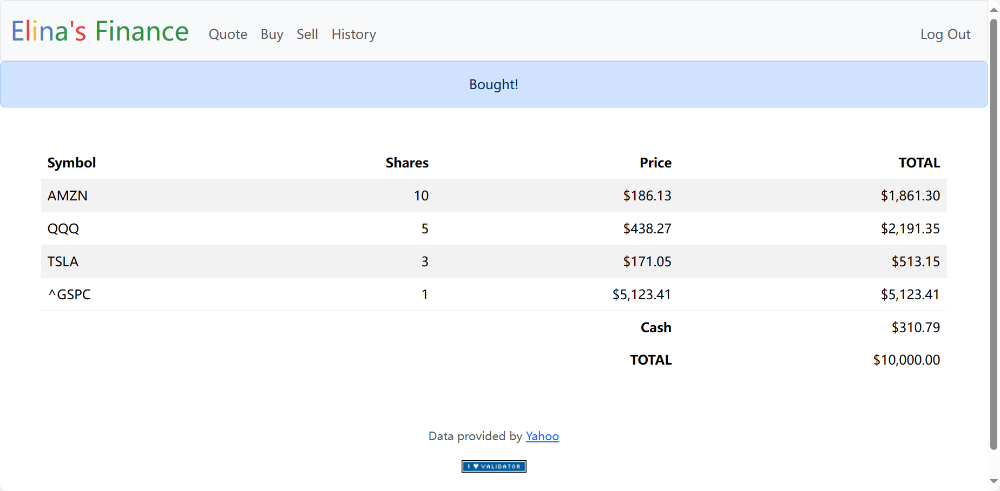

# Stock Trading Website

This is a web application for a mock stock trading platform called Elina's Finance . The platform allows users to "buy" and "sell" stocks by querying real stock prices and keeping track of users' portfolios.

## Features

| Function | Description |
|----------|-------------|
| Register | Provides a user registration interface for new users to create an account on the platform. |
| Index    | Displays an overview of the user's portfolio including the current value of all owned stocks. |
| Quote    | Allows users to look up the current price of a stock using its symbol. |
| Buy      | Enables users to "purchase" shares of a stock at its current price and add them to their portfolio. |
| Sell     | Permits users to "sell" shares of a stock they own, thereby removing them from their portfolio and adding the cash to their balance. |
| History  | Shows the history of all transactions that a user has performed, including buys and sells, with timestamps. |

## Technologies Used

- Python
- Flask
- SQL
- HTML/CSS
- JavaScript

## Acknowledgment

This is a course project of Harvard's CS50x: Introduction to Computer Science. For detailed project description, please look at:
https://cs50.harvard.edu/x/2023/psets/9/finance/
